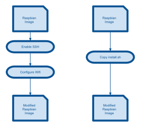

This activity consists in installing the latest Raspbian distribution on a new SD Card to be used by a Raspberry Pi

# General Principle

TBC

# Process

## Download Raspbian image

## Configure Wifi

## Update distribution

# Automation

To 
