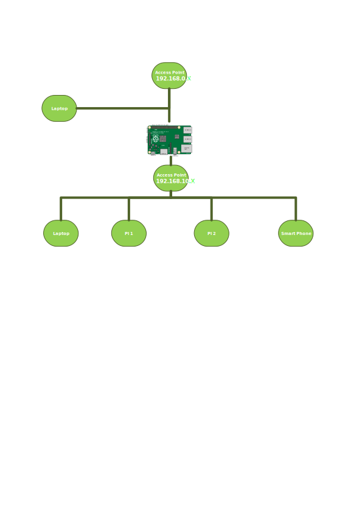

The purpose of this activity is to prepare the use of HTTPS for WebRTC usage

Running a DNS on a raspberrypi would allow to use wwww.expi.dev as a domain name on the local network.



## Configuration access point

`sudo apt-get install hostapd`

type `sudo vi /etc/hostapd/hostapd.conf`
And append
```shell
# update with relevant country
country_code=US
interface=wlan0

ssid=[AP_SSID]
hw_mode=g
channel=6
wmm_enabled=0
macaddr_acl=0
auth_algs=1
ignore_broadcast_ssid=0
wpa=2
wpa_passphrase=[AP_PASS]
wpa_key_mgmt=WPA-PSK
wpa_pairwise=TKIP
rsn_pairwise=CCMP
```

Execute `sudo vi /etc/default/hostapd` and replace line #DAEMON_CONF with
```text
DAEMON_CONF="/etc/hostapd/hostapd.conf"
```

Start the service
```shell
sudo systemctl unmask hostapd
sudo systemctl start hostapd
```
